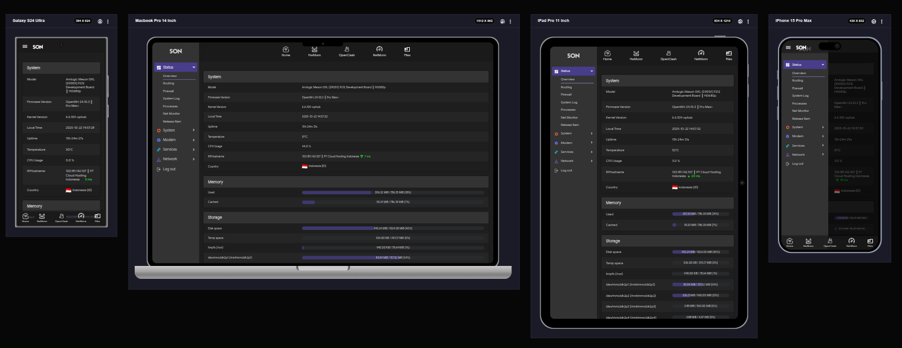
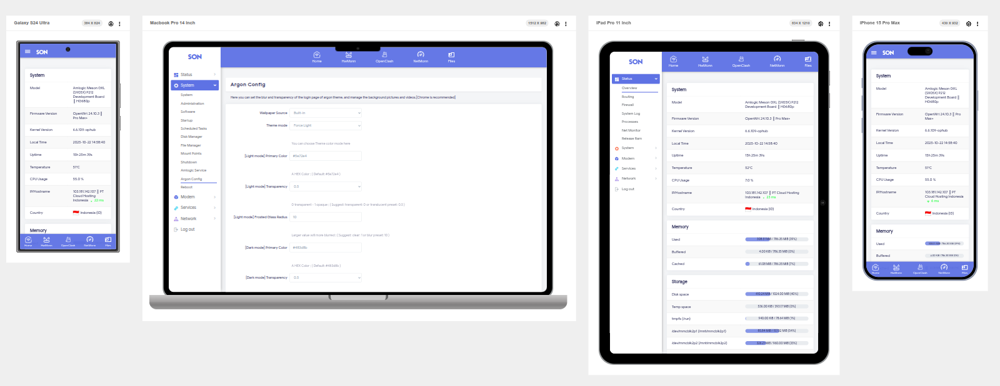

<!--
  README versi Bahasa Indonesia - mod dari jerrykuku/luci-theme-argon v2.4.4
  - Diterjemahkan dan dikembangkan agar mudah dibaca.
  - Tidak terlalu formal, tapi informatif.
-->

<div align="center">
  

  # Argon (MOD) — Tema LuCI untuk OpenWrt

</div>

Argon adalah tema LuCI yang bersih dan rapi untuk OpenWrt. Tema ini
membuat tampilan antarmuka web router jadi lebih modern, dan mendukung
kustomisasi halaman login dengan gambar atau video. Argon juga memudahkan
peralihan antara mode terang dan gelap, baik otomatis maupun manual.

> [!NOTE]  
> Ini adalah versi mod dari repository original [jerrykuku/luci-theme-argon](https://github.com/jerrykuku/luci-theme-argon.git)
(v2.4.4).

## Fitur utama

- Tampilan bersih dan modern untuk LuCI
- Dukungan wallpaper gambar/video di halaman login
- Mode terang/gelap (auto/manual)
- Paket IPK siap pakai untuk pemasangan cepat
- Integrasi dengan `luci-app-argon-config` (opsional) untuk pengaturan lewat GUI

## Fitur tambahan pada mod ini

- Penambahan tombol navigasi cepat di atas halaman LuCI untuk akses mudah ke halaman favorit.
- Implementasi Bottom Navigation Bar di bagian bawah halaman LuCI untuk navigasi yang lebih nyaman pada perangkat mobile.
- Custom CSS tambahan untuk memperbaiki tampilan elemen tertentu di LuCI.
- Peningkatan tampilan responsif agar lebih baik di berbagai ukuran layar.
- Dan lain-lain.

## Persiapan & Instalasi cepat

Contoh perintah untuk mengunduh dan memasang tema (LuCI 24.10):

```bash
wget --no-check-certificate https://github.com/alrescha79-cmd/luci-theme-argon-mod/releases/download/v2.4.4/luci-theme-argon_2.4.4-r20251022_all.ipk
opkg install luci-theme-argon*.ipk
```

Jika ingin memasang UI konfigurasi (opsional):

```bash
wget --no-check-certificate -O luci-app-argon-config_0.9_all.ipk https://github.com/jerrykuku/luci-app-argon-config/releases/download/v0.9/luci-app-argon-config_0.9_all.ipk
opkg install luci-app-argon-config*.ipk
```

Catatan singkat:

- Gunakan perintah di atas pada perangkat OpenWrt yang punya akses ke internet.
- Link IPK tema diarahkan ke rilis di repository mod (`alrescha79-cmd`).

## Screenshot




## Kustomisasi wallpaper

File wallpaper ditempatkan di folder tema:

- Gambar / video: `htdocs/luci-static/argon/background/`

Untuk otomatisasi wallpaper, skrip peladen terkait ada di:

- `root/usr/libexec/rpcd/luci.argon_wallpaper` (lihat isi repositori untuk detail)

Jika menggunakan `luci-app-argon-config`, Anda bisa mengubah wallpaper
dan opsi lainnya lewat antarmuka LuCI.

## Kontribusi & Sumber

Repositori asli: https://github.com/jerrykuku/luci-theme-argon (versi dasar v2.4.4)

Repositori mod ini: https://github.com/alrescha79-cmd/luci-theme-argon-mod

Kalau mau kontribusi, buka issue atau PR di repositori mod/asal sesuai
lokasi perubahan yang diinginkan.

## Lisensi

Lisensi mengikuti berkas `LICENSE` yang ada di repositori ini. Lihat file
`LICENSE` untuk detail izin penggunaan dan distribusi.

## Terima kasih

Terima kasih kepada [jerrykuku](https://github.com/jerrykuku) atas kerja keras pada tema Argon asli — mod
ini cuma penyesuaian kecil. Kalau ada yang
ingin dikembangkan lagi (fitur, perbaikan tampilan, atau dukungan perangkat),
beri tahu lewat issue di GitHub.

--
